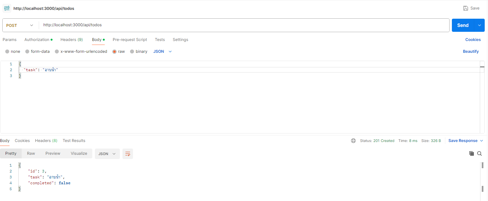
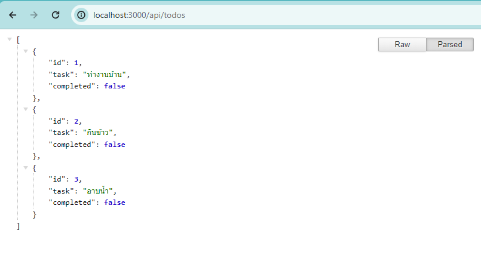

# Todo List App

>**Note**: This is a simple Todo List application built with Node.js and Express.

## Features
- **Create Todo**: You can create a new todo by sending a POST request to `/api/todos` with a JSON object containing the task.
- **Update Todo**: You can update a todo by sending a PUT request to `/api/todos/:id` with the todo ID in the URL parameter and a JSON object containing the updated task and completion status.
- **Delete Todo**: You can delete a todo by sending a DELETE request to `/api/todos/:id` with the todo ID in the URL parameter.
- **List Todos**: You can retrieve a list of all todos by sending a GET request to `/api/todos`.

## Technologies Used

- Node.js
- Express
- TypeScript

## Installation

1. Clone the repository:
```bash 
git clone https://github.com/6010110455/mydev_health_plaza_node_todolist.git
```
2. Install dependencies:
```bash 
cd mydev_health_plaza_node_todolist
npm install
```
3. Start the server:
```bash 
npm start
```
4. The server should now be running on http://localhost:3000.

## Usage

1. Use any API testing tool such as Postman to interact with the API endpoints.
2. Send HTTP requests to create, update, delete, or retrieve todos.

## API Documentation

### Create Todo

- URL: `/api/todos`
- Method: `POST`
- Request Body: JSON object with the task.
- Response: JSON object of the created todo.



### Update Todo

- URL: `/api/todos/:id`
- Method: `PUT`
- URL Parameter: ID of the todo to be updated.
- Request Body: JSON object with the updated task and completion status.
- Response: JSON object of the updated todo.

### Delete Todo

- URL: `/api/todos/:id`
- Method: `DELETE`
- URL Parameter: ID of the todo to be deleted.
- Response: No content (204).

### List Todos

- URL: `/api/todos`
- Method: `GET`
- Response: JSON array of all todos.

